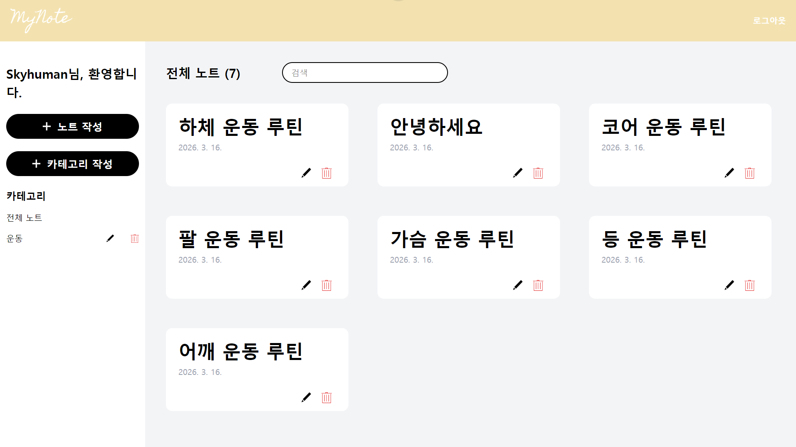
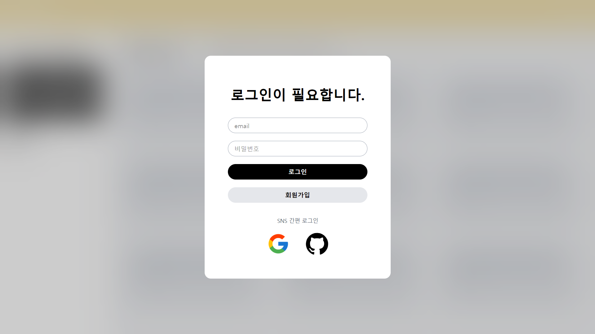
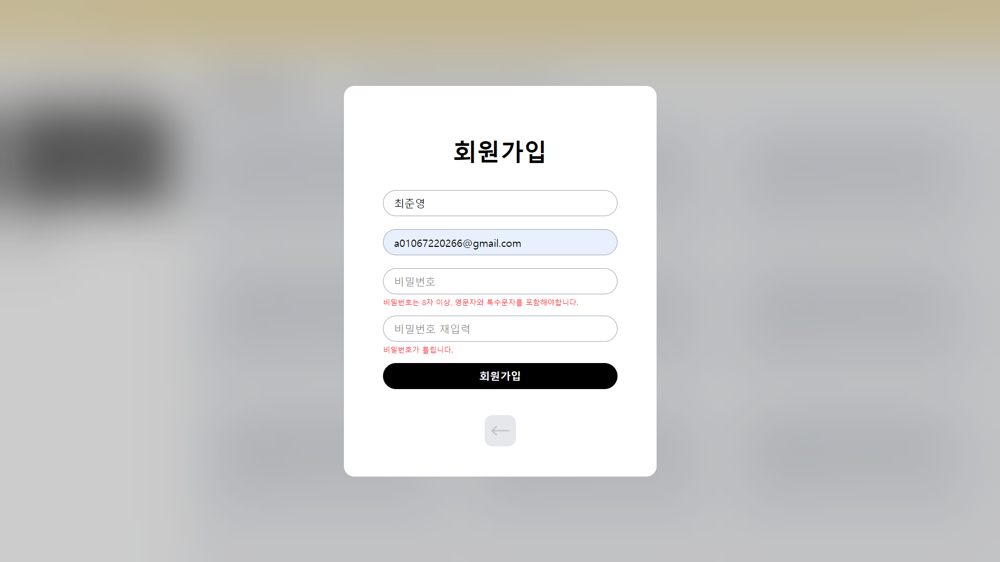
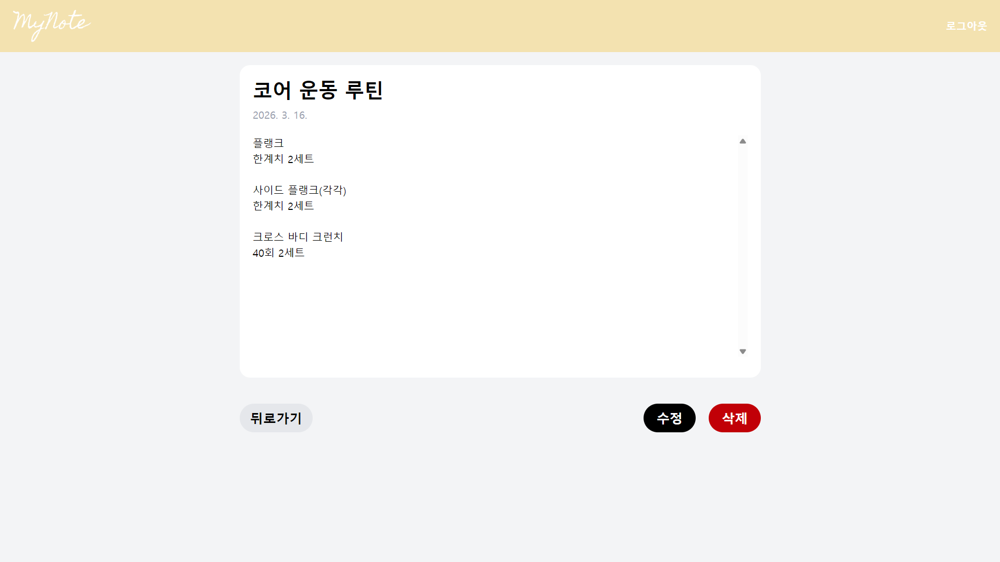
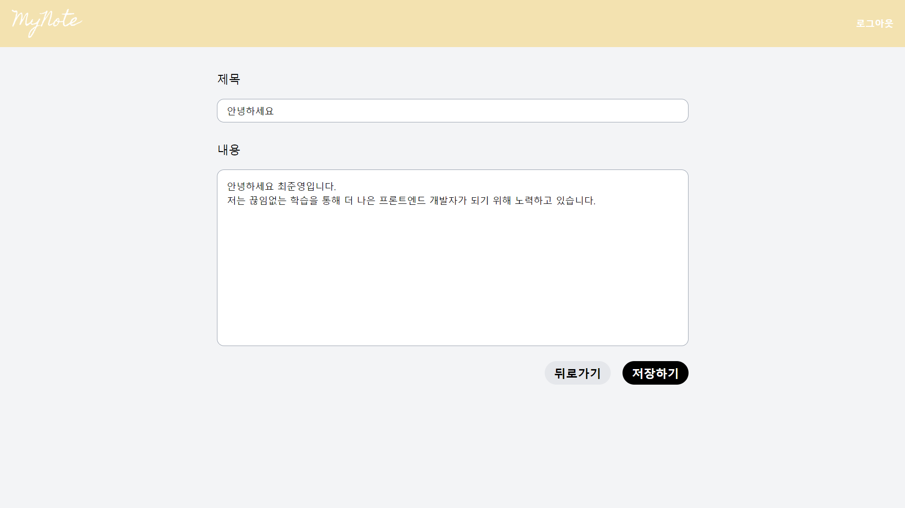
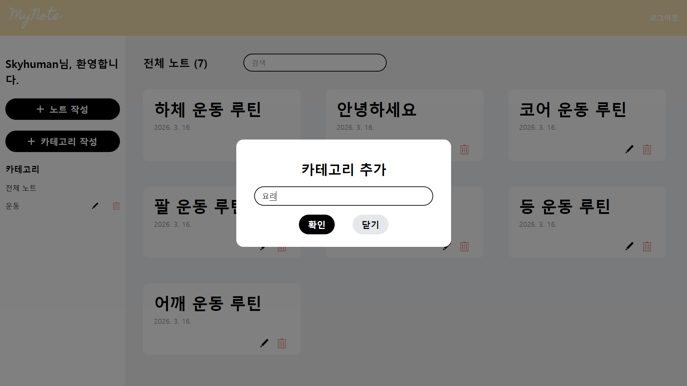
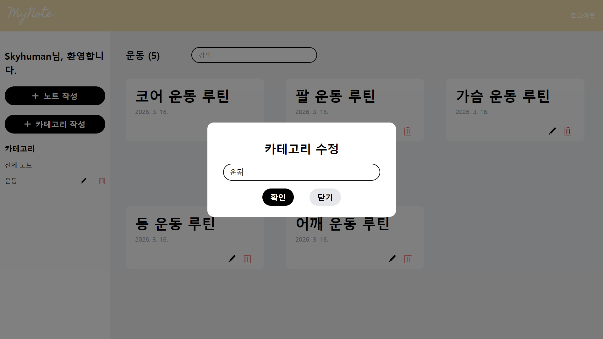
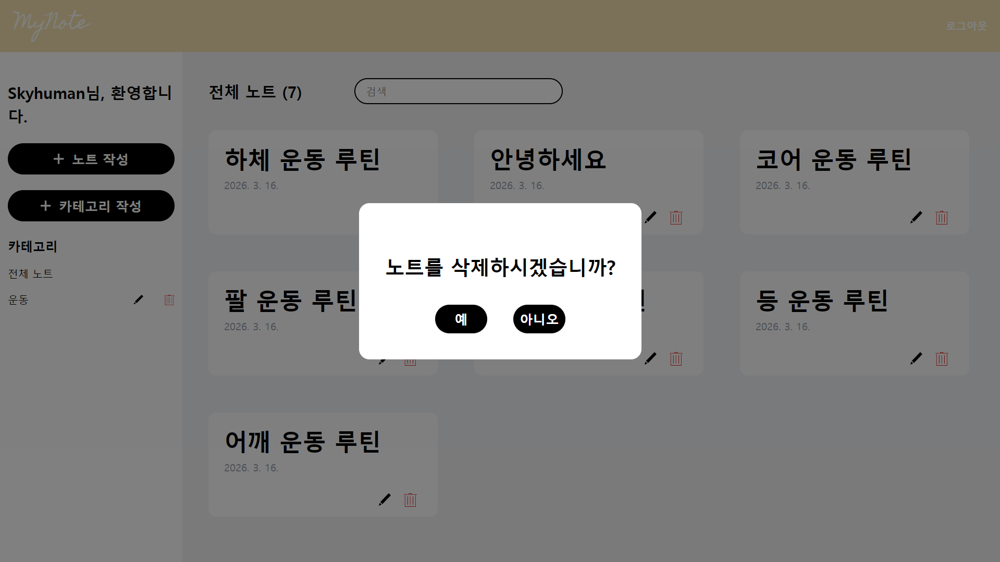

# 마이노트

React와 Firebase를 활용하여 인증, 실시간 데이터 처리, 상태 관리를 포함한 
풀스택 흐름을 직접 구현한 노트 웹 애플리케이션입니다.

로그인 후 노트를 작성·수정·삭제하고, 카테고리로 체계적으로 정리할 수 있습니다.

배포 링크: [마이노트](https://my-noteabc.netlify.app/)

## 🛠️ Tech Stack

- FrontEnd
  
    
    
    
    
    

- Server

    

- Development Tools

    
    
    

- Deploy

    

## 💻 Preview

- 메인 화면
  
    

    - 노트 작성 / 수정 / 삭제 기능 (CRUD)
    - 카테고리 추가 / 수정 / 삭제 기능 (CRUD)
    - 노트 클릭 시 노트 확인 기능
    - 노트 검색
    - 카테고리에 따른 노트 조회

- 로그인 화면
  
    

    - 이메일 로그인 및 Google, GitHub OAuth 인증

- 회원가입 화면
  
    

    - 회원가입 기능 구현
    - 닉네임, 이메일, 비밀번호 등 사용자 정보 Firestore에 생성

- 노트 확인

    

    - 메인 화면에서 노트 클릭 시 노트 내용 확인
    - 페이지에서 수정 및 삭제

- 노트 작성 & 수정

    

    - 제목 & 내용 작성
    - 작성한 노트는 Firestore에 저장

- 카테고리 추가 & 수정

    
    

    - 생성 된 카테고리는 Firestore에 저장
    - 카테고리 이름 수정 기능 구현
    - 카테고리 삭제 시 Firestore에서 삭제

- 노트 삭제

    

    - 노트 삭제 시 Firestore에서 삭제

## 🗺️ User Flow

1. 접속 → 로그인 / 회원가입
   - 신규 사용자 → 회원가입 → 로그인
   - 기존 사용자 → 이메일 또는 Google·GitHub OAuth 로그인
2. 메인 화면 진입
   - 노트 작성 → Firestore 저장 → 목록 반영
   - 카테고리 선택 → 해당 노트 필터링
   - 노트 클릭 → 상세 확인 → 수정 / 삭제
3. 로그아웃

## 🐛 Trouble Shooting

### 로그인 전 창 상태
- 문제
  - 로그인 창 내에서 로그인 모드와 회원가입 모드 전환
  - 로그인 후에도 창이 유지되는 문제 발생
- 해결
  - AuthModal 컴포넌트에서 mode 상태 선언 후 SignIn.tsx / SignUp.tsx에 mode 상태 변환 함수를 props로 전달
  - App.tsx에서 user 상태 선언 후 onAuthStateChanged를 통해 유저 유무 상태 확인

### DB 구조 구축 문제
- 문제
  - 유저와 노트, 카테고리 간의 관계 설계
  - 사용자별 노트 분류가 불명확하면 보안 및 데이터 관리 문제 발생
- 해결
  - 최상위 컬렉션을 "users"로 설정하여 사용자 단위로 데이터 분리
  - 문서 ID를 사용자 UID로 지정하여 인증 정보와 DB를 일관성 있게 연결
  - 각 사용자 문서 하위에 "note", "category" 서브컬렉션을 구성
  - 이를 통해 사용자별 데이터 접근을 명확히 하고 확장성을 고려한 구조 설계

### 노트 로딩 문제
- 문제: getDocs 사용 시 메인페이지가 새로고침이 되야만 노트 리스트 상태 변화
- 해결
  - getDocs 대신 onSnapshot사용으로 노트 데이터 실시간 로딩
  - 이를 통해 사용자 경험을 개선하고 불필요한 새로고침을 제거

## 📖 배운 점
- Firestore의 컬렉션/문서 구조를 직접 설계하며 데이터 모델링 경험
- onAuthStateChanged로 사용자 인증 상태 기반 처리 경험
- onSnapshot을 통해 실시간 데이터 동기화 및 상태 관리 흐름 이해
- vercel을 이용한 웹 애플리케이션 자동 배포 구조 경험
- Firebase 환경 변수 (.env)분리를 통해 환경과 로컬 환경을 구분 설정 경험

## 🚀 Future Improvement

- 자주 사용하는 노트를 빠르게 접근하기 위해 즐겨찾기 기능 추가
- 모바일 사용자를 위한 반응형 디자인 개선
- 마크다운 작성 방식 지원을 통해 더 풍부한 작성 환경 제공
